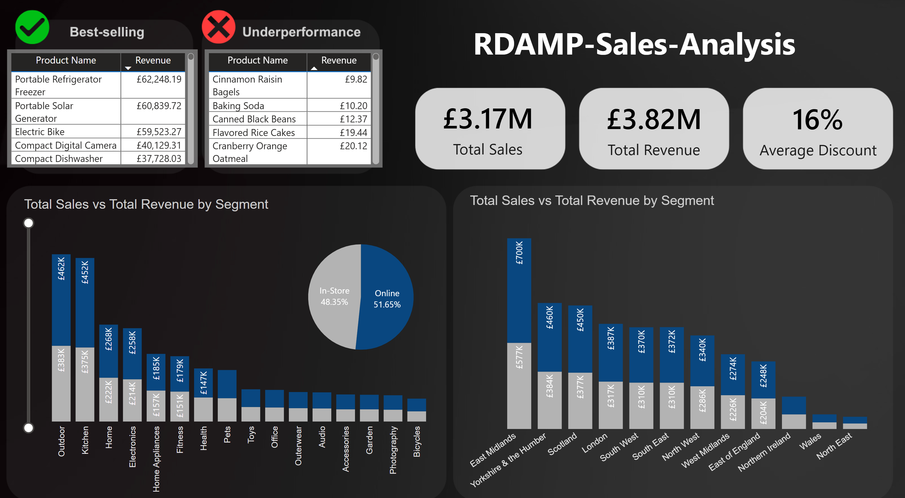
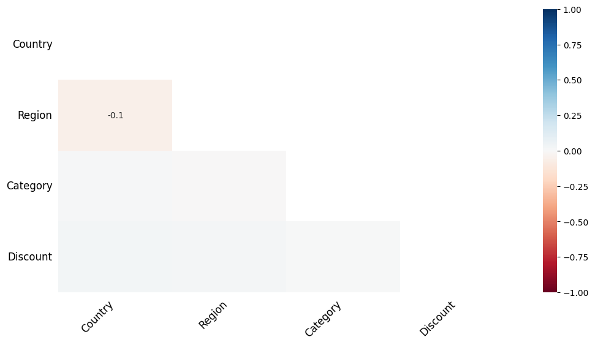
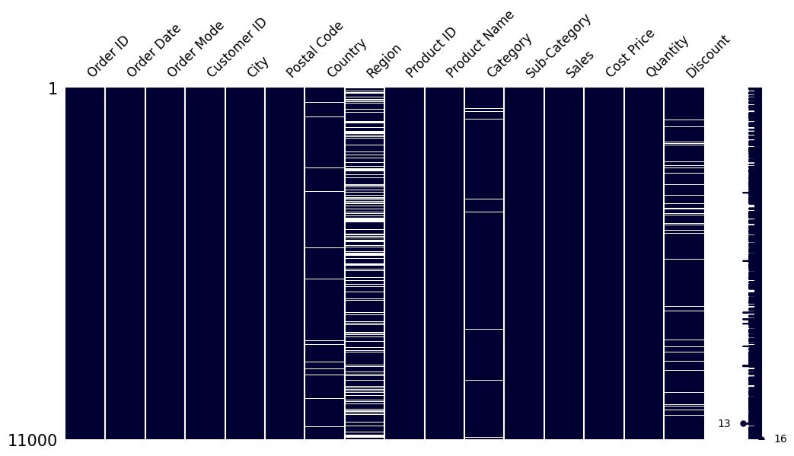
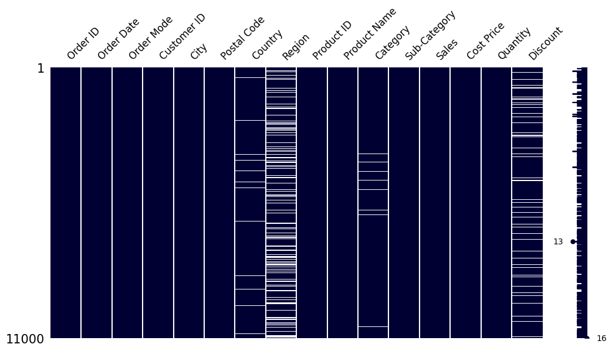
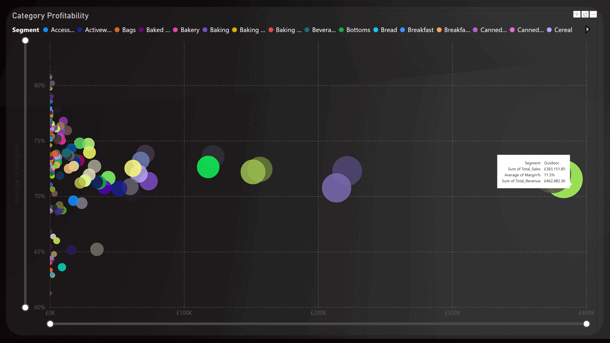

# 🚀 RDAMP-Sales-Analysis- Initial Data Exploration & Business Insights Report🚀
---

> _Answering foundational questions on sales, revenue, product performance, and channels._

---

## 📋 1. Executive Summary
_Through structured data cleaning and exploration, I analyzed sales performance by segment, region, and order mode. After resolving over 3,000 missing values and standardizing fields, I built new revenue and margin metrics. Our top finding highlights that online orders slightly outperforming higher margins than in-store, and I recommend targeting margin-rich categories through online channels._
- **Scope:** Assess data quality, summarize sales performance by region/segment, identify best/underperformers, analyze margins and channel mix.
- **Top Findings:**  
  - 💰 Total revenue reached **£3.82M**.
  - 🔍 Top-performing segments include **Outdoor and Kitchen**  
  - ↗️ **Portable Refrigerator Freezer** is top‐seller; ↘️**Cinnamon Raisin Bagels** underperforms.  
  - 🌐 Online sales (51.65%) slightly outperforming In-Store sales and showing stronger margin opportunities.
  - 📊 Discounting averaged **16%**, contributing to the gap between total revenue (£3.82M) and actual sales (£3.17M).
  - 📌 Recommendations:

    - **Focus marketing** on high-margin categories, especially in the **Online** channel.
    - **Reevaluate or reprice** underperforming products; consider bundling or promotions.
    - **Clean input pipelines** for `Region`, `Discount`, and `Category` to prevent recurring missing data.
    - **Enhance data validation** at source to avoid malformed or incomplete entries.

---

---

## 🎯 2. Objectives & Business Questions
1. **Data Quality Assessment**  
   - Missing values, anomalies, duplicates  
2. **Performance Summaries**  
   - Total sales, revenue, discount rates by region & segment  
3. **Product Analysis**  
   - Top 5 best‑selling products  
   - Bottom 5 performers by revenue  
4. **Margin Insights**  
   - Categories with highest gross margins  
5. **Channel Analysis**  
   - Sales distribution: Online vs In‑Store  
6. **Tools Used**  
   - Excel (pivot tables, VLOOKUP/IF)
   - Power BI (embedded visuals)    
   - Python (pandas, missingno)

---

## 📂 3. Data Overview
| **File Name**                                             | **Description**                                    | **Notes**                            |
| --------------------------------------------------------- | -------------------------------------------------- | ------------------------------------ |
| `Mariel_Palacio_TASK-INT001-RDAMP.xlsx`                   | Raw and cleaned sales dataset                      | 16 original columns → 23 final       |
| `Mariel_Palacio_PowerBi_RDAMP_Sales_Analysis.pbit`        | Power BI template with visuals and measures        | Interactive dashboard template       |
| `Mariel_Palacio_Dashboard.png`                            | Static image of the final Power BI dashboard       | Embedded in report                   |
| `Mariel_Palacio_Profit_GIF.gif`                           | Animated visualization showing profit trends       | Ideal for presentations or README    |
| `Mariel_Palacio_Heatmap_Missingno.png`                    | Heatmap showing missing data patterns using Python | Generated with `missingno.heatmap()` |
| `Mariel_Palacio_Missing_Values_Distribution_Sorted.png`   | Sorted bar chart of missing values per column      | Aids in prioritizing data cleaning   |
| `Mariel_Palacio_Missing_Values_Distribution_Unsorted.png` | Unsorted distribution of missing values per column | Initial view before sorting          |

---

## 🛠️ 4. Data Quality Assessment
- **Dataset Description**

The dataset consists of order-level transactional data and supporting lookup tables. Below is a summary of the main fields used:

| **Field**         | **Type**     | **Description**                                                                 |
|------------------|--------------|---------------------------------------------------------------------------------|
| `Order ID`       | String       | Unique identifier for each transaction                                         |
| `Order Date`     | Date         | Date of the order (format: mm/dd/yyyy)                                         |
| `Order Mode`     | String       | Sales channel: either **Online** or **In-Store**                               |
| `Customer ID`    | String       | Unique identifier for each customer                                            |
| `City`           | String       | Customer’s city (some missing values)                                          |
| `Postal Code`    | String       | UK postal code                                                                 |
| `Country`        | String       | Customer country (e.g., England, Scotland)                                     |
| `Region`         | String       | UK region (e.g., North, South, West); some missing values                      |
| `Product ID`     | String       | Unique identifier for each product sold                                        |
| `Product Name`   | String       | Name or description of the product                                             |
| `Category`       | String       | Broad product classification (e.g., Food - Spices)                             |
| `Sub Category`   | String       | Detailed product classification (e.g., Rubs and Seasonings)                   |
| `Cost Price`     | Float        | Internal cost per unit                                                         |
| `Sales`          | Float        | Revenue generated after discount (per unit)                                    |
| `Quantity`       | Integer      | Number of units sold                                                           |
| `Discount`       | Float        | Discount rate (0–1, e.g., 0.15 = 15%)                                           |

---
- 🔍**Issues Identified and Actions Taken**

| **Table**          | **Column**       | **Issue**                                 | **Resolution**                                                                 |
|--------------------|------------------|-------------------------------------------|---------------------------------------------------------------------------------|
| `Retail_Table`     | `Country`        | 220 missing values                        | Completed using postal code and region info from `Store_Loc_Table`             |
| `Retail_Table`     | `Region`         | 2811 missing or unmatched entries         | Completed using context and store location mapping                             |
| `Retail_Table`     | `Category`       | 198 missing values                        | Imputed manually based on product names and subcategories                      |
| `Retail_Table`     | `Discount`       | 973 missing values                        | Imputed with 0; distribution was similar to non-missing entries                |
| `Retail_Table`     | `Order ID`       | Possible duplicates                       | Verified uniqueness — no duplicates found                                      |
| `Retail_Table`     | `Order Date`     | Disordered dates                          | Sorted chronologically                                                         |
| `Retail_Table`     | `Product ID/Name`| One-to-one mapping expected               | Verified consistent mapping                                                    |
| `Store_Loc_Table`  | All              | 3 rows with missing city/region/postal    | Completed using external sources                                               |
| `Store_Loc_Table`  | `Region`         | Typos (e.g., "Yorkshire and the Humber")            | Standardized names (e.g., "Yorkshire & the Humber")                                      |

- 🔧 **Data Transformation Workflow**

The following steps were carried out to clean and enhance the dataset:

1. **Sorted** all orders chronologically by `Order Date`.
2. **Completed missing values** for `Country` and `Region` using `Store_Loc_Table`.
3. **Verified uniqueness** of `Order ID` and one-to-one relationship between `Product ID` and `Product Name`.
4. **Imputed missing discounts** in `Discount` column with `0`, creating a new column: `Discount_Cleaned`.
5. **Completed `Category` values** manually using context and product-level mapping (see appendix for mapping).
6. **Created a new field `Segment`** to group products at a higher level (based on a custom `Segment_Table`).
7. **Created derived columns:**
   - `Total Sales` = `Sales × Quantity`
   - `List Price` = `Sales / (1 - Discount_Cleaned)`
   - `Total Revenue` = `List Price × Quantity`
8. **Built summary pivot tables** for:
   - `Segment` vs (Total Sales, Total Revenue, Avg Discount)
   - `Order Mode` frequency
   - `Region` vs (Sales, Revenue, Discount)
---

## 📊 5. Exploratory Analysis & Visualizations

### Exploratory Analysis  
```python
import pandas as pd

#Basic Check and Overlook
Retail_DB.info()
Retail_DB.describe()
Retail_DB.isnull().sum()

#To check that a product and its ID are uniquely related, and viceversa
id_to_product = Retail_DB.groupby('Product ID')['Product Name'].nunique()
ids_invalidos = id_to_product[id_to_product > 1]
print("IDs associated with more than one product:")
print(ids_invalidos)

product_to_id = Retail_DB.groupby('Product Name')['Product ID'].nunique()
productos_invalidos = product_to_id[product_to_id > 1]
print("Productos asociados a más de un ID:")
print(productos_invalidos)

#To analize the Distribution of the missing values
import missingno as msno
msno.heatmap(Retail_DB,figsize=(12, 6), fontsize=12)
```
 

```python
msno.matrix(Retail_DB,figsize=(12, 6), fontsize=12, color=[0,0,0.2])
```
 

```python
#Something look wrong, dates were unsorted
Clean_Retail_DB = Retail_DB
Clean_Retail_DB['Order Date'] = pd.to_datetime(Clean_Retail_DB['Order Date'], format='%d/%m/%Y')

#Now better
msno.matrix(Sorted_Retail_DB,figsize=(12, 6), fontsize=12, color=[0,0,0.2])
```
  

Distribution was similar to non-missing entries, and random.

### 📊 Key Business Insights and Visualizations


1. **Sales & Revenue by Segment and Region** 
   - Segments like *Outdoor*, *Kitchen*, and *Home* generate high sales volumes but vary in discount levels.

2. **Best- and Worst-Performing Products (by Revenue)** 

| **Top 5**               | **Revenue**      |
|--------------------------------|------------------|
| Portable Refrigerator Freezer  | £62,248.19       |
| Portable Solar Generator       | £60,839.72       |
| Electric Bike                  | £59,523.27       |
| Compact Digital Camera         | £40,129.31       |
| Compact Dishwasher             | £37,728.03       |

| **Bottom 5**              | **Revenue**   |
|-------------------------------|---------------|
| Cinnamon Raisin Bagels        | £9.82         |
| Baking Soda                   | £10.20        |
| Canned Black Beans            | £12.37        |
| Flavored Rice Cakes           | £19.44        |
| Cranberry Orange Oatmeal      | £20.12        |

- Underperformers are often niche or miscategorized items.
   
3. **Order Mode Analysis**  
   - **Online** sales (51.65%) slightly outperforming In-Store sales and showing stronger margin opportunities.

 
4. **Margin Analysis by Category**  
   - Categories such as *Outdoor* and *Kitchen* show higher margins.  
   - Food-related categories tend to have tighter margins but high volume.

---

### 📌 Recommendations

- **Focus marketing** on high-margin categories, especially in the **Online** channel.
- **Reevaluate or reprice** underperforming products; consider bundling or promotions.
- **Clean input pipelines** for `Region`, `Discount`, and `Category` to prevent recurring missing data.
- **Enhance data validation** at source to avoid malformed or incomplete entries.

---

### 📈 Visualizations

> All visuals were developed using a mix of Power BI and Python (missingo).

 
*Figure 1: Sales vs Revenue by Segment*
*Figure 2: Sales vs Revenue by Region*
*Figure 3: Order Mode Split – Online vs In-Store*
*Figure 4: Top 5 Products by Revenue*
 
  
*Figure 5:Category Profitability by Segment*

  
*Figure 6:Heatmap created with Missingno Library*


*Figure 7:Missing Values Distribution with Dates Unsorted*


*Figure 8:Missing Values Distribution with Dates Sorted*

---

## 🧮 Appendix: Manual Category Assignments

Manual imputations of missing `Category` values were done using the product name and subcategory. Below is a sample:

| **Product Name**                                   | **Code** | **Category**              | **Subcategory**                          |
|----------------------------------------------------|---------:|----------------------------|-------------------------------------------|
| Aeropress Coffee Maker                             |        3 | Kitchen                   | Coffee Maker                              |
| Almond Flour Pancake Mix                           |        4 | Food - Baking Goods       | Gluten-Free Pancake Mix                   |
| Biodegradable Dog Waste Bags                       |        9 | Pets                      | Dog Waste Bag Dispenser                   |
| Cat Tree with Scratching Posts                     |        6 | Pets                      | Cat Tree                                  |
| Chili Con Carne Mix                                |        4 | Food - Spices             | Chili Powder                              |
| Chino Shorts                                       |        6 | Clothing - Bottoms        |                                           |
| Chocolate Peanut Butter Cups                       |        4 | Food - Snacks             | Dark Chocolate Almond Butter Cups         |
| Dark Chocolate Raisins                             |        4 | Food - Snacks             | Dark Chocolate Covered Almonds            |
| Digital Voice Recorder                             |        7 | Electronics               |                                           |
| Eco-Friendly Stainless Steel Straws                |        2 | Kitchen                   | Stainless Steel Straws                    |
| Electric Butter Churn                              |        3 | Kitchen                   | Electric Milk Frother                     |
| Electric Razor                                     |        9 | Health                    | Personal Care & Grooming                  |
| Garlic Herb Seasoning                              |        6 | Food - Seasonings         | Lemon Pepper Seasoning                    |
| Greek Feta Cheese                                  |        5 | Food - Dairy              | Feta Cheese                               |
| Green Smoothie Mix                                 |        6 | Food - Beverages          | Peach Mango Smoothie Mix                  |
| Hibiscus Herbal Tea                                |        7 | Food - Beverages          | Hibiscus Tea Bags                         |
| LED Flashlight with Rechargeable Batteries         |        2 | Outdoor                   | Camping Lantern                           |
| Multi-Cooker                                       |       13 | Kitchen                   | Electric Rice Cooker                      |
| Multi-Purpose Marine Rope                          |        6 | Outdoor                   | Tailgating Set                            |
| Organic Coconut Flour                              |        5 | Food - Baking             | Organic Almond Flour                      |
| Organic Quinoa                                     |        5 | Food - Grains             | Quinoa                                    |
| Organic Quinoa Salad                               |        1 | Food - Prepared Foods     | Quinoa Salad                              |
| Outdoor Sports Backpack                            |        6 | Outdoor                   | Outdoor Accessories                       |
| Peanut Butter Granola                              |        6 | Food - Cereal             | Chocolate Hazelnut Granola                |
| Plant-Based Meal Prep Containers                   |        6 | Kitchen                   | Glass Food Containers                     |
| Portable Air Conditioner                           |        8 | Home Appliances           | Window A/C Unit                           |
| Portable Phone Mug Holder                          |        5 | Automotive                | Automotive Accessories                    |
| Portable Speakers                                  |        5 | Audio                     | Portable Bluetooth Speaker                |
| Smart Wi-Fi Light Bulbs                            |        7 | Smart Home                | Smart Light Switch                        |
| Smartphone Projector                               |        4 | Electronics               | Smartphone Projector Kit                  |
| Spicy BBQ Sauce                                    |        6 | Food - Condiments         | BBQ Sauce                                 |
| Sunflower Seeds                                    |       10 | Food - Snacks             | Pumpkin Seeds                             |
| USB Flash Drive                                    |        1 | Computers                 | USB-C Hub                                 |
| Weighted Blanket                                   |        3 | Health                    | Weighted Blanket for Adults               |
| Whole Grain Mustard                                |        3 | Food - Condiments         | Mustards                                  |
| Whole Roasted Chicken                              |       11 | Food - Prepared Meals     |                                           |


---
